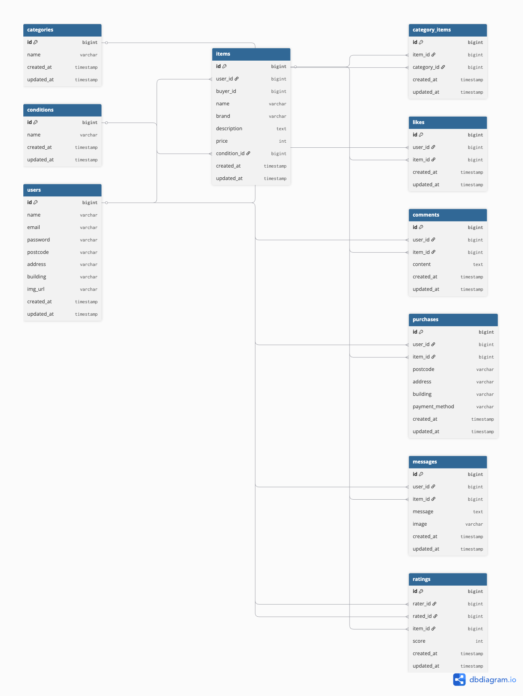

# フリマアプリ（fleamarket-app）

## アプリ概要
フリマアプリを想定したWebアプリです。  
商品一覧（おすすめ / マイリスト）、商品詳細、いいね、コメント、出品、購入、送付先住所変更、マイページ機能に加え、取引チャット機能・評価機能を実装しています。

---

## 環境構築（Docker）

### 1. リポジトリをクローン
git clone <このリポジトリURL>  
cd fleamarket-app  

### 2. Dockerを起動
docker compose up -d --build  

### 3. Laravel初期設定
docker compose exec php composer install  
docker compose exec php cp .env.example .env  
docker compose exec php php artisan key:generate  

### 4. マイグレーション & シーディング
docker compose exec php php artisan migrate --seed  

### 5. 画像表示用のシンボリックリンク作成
docker compose exec php php artisan storage:link  

---

## 動作確認URL
アプリ: http://localhost:8080  
phpMyAdmin: http://localhost:8081  

---

## 使用技術（実行環境）
PHP 8.2  
Laravel 12.x  
MySQL 5.7  
nginx  
Docker / Docker Compose  

---

## 実装機能

### 商品関連
- 商品一覧（おすすめ / マイリスト切替、検索）
- 商品詳細
- 商品出品（画像アップロード）
- 商品編集・削除

### ユーザー機能
- 会員登録 / ログイン（Laravel Fortify）
- マイページ表示
- プロフィール情報表示
- 評価平均表示（四捨五入）

### 取引機能
- 商品購入
- 送付先住所変更

### チャット機能
- メッセージ送信（本文・画像）
- メッセージ編集 / 削除
- 入力保持機能
- バリデーション（FormRequest）
- エラーメッセージ表示

### 取引管理機能
- 取引中商品の表示
- 新着メッセージ順ソート
- 未読メッセージ件数表示

### 評価機能
- 取引完了後のユーザー評価
- 評価後の画面遷移
- 評価平均表示（四捨五入）

### その他
- いいね機能
- コメント機能

---

## メール機能
取引完了時に出品者へメール送信処理を実装しています。  
（Mailhog / Mailtrapを使用した動作確認を想定）

---

## 画像アップロードについて
画像は storage/app/public/ 配下に保存されます。  
php artisan storage:link を実行し、public/storage 経由で表示しています。

---

## ER図

---

## テストユーザー

【テストユーザー（メル）】  
メール：test123@example.com  
パスワード：test1234  

【テストユーザー（メル2）】  
メール：test456@example.com  
パスワード：test4567  